# DSFR Chart

DSFR Chart est un module complémentaire au Système de design de l’État (DSFR) pour la visualisation de données. Il s'agit d'une bibliothèque de composants [Vue.js](https://vuejs.org/), sous la forme de web-components, à destination des développeurs ayant besoin de graphiques pour représenter des données.

## Demo

L'ensemble des graphiques disponibles sont mis en situation sur la page de [demo](https://gouvernementfr.github.io/dsfr-chart/).

## Installation

L'installation de **DSFR Chart** peut se faire de manières différentes. En téléchargeant l'ensemble des fichiers nécessaires à son utilisation ou en utilisant le gestionnaire de paquets **NPM**.

### Fichiers statiques

Il est possible de télécharger l'ensemble du DSFR au format zip ci-dessous. Le zip contient un ensemble de fichiers CSS et Javascript permettant l'utilisation des différents graphiques.

Vous trouverez sur la page [Release de Github](https://github.com/GouvernementFR/dsfr-chart/releases), toutes les sources des versions précédentes et la dernière en date.

### NPM

**DSFR Chart** est disponible sur NPM via un ensemble de packages qu'il est possible d'ajouter directement à votre projet. Il est de ce fait nécessaire d'installer [NodeJS](https://nodejs.org), et d'avoir un fichier **package.json** à la racine de votre projet. (Il est possible d'en créer un directement via la commande `npm init`).

Une fois en place, il suffit d'installer le package **dsfr-chart** contenant l’ensemble des composants:

```
npm install dsfr-chart
```

Une fois terminé dsfr-chart sera alors installé dans le dossier `node_modules/dsfr-chart/`

### Structure de DSFR-Chart

La structure mise à disposition, sur le zip ou npm est la suivante :

-   **Charts** : contient les fichiers js et css à importer pour utiliser toutes les représentations disponibles.

-   **Un dossier par type de représentation** (ex : LineChart) contenant les fichiers js et css à importer pour l'utilisation d'un seul type de graphique.

### Configuration de votre projet

#### Prérequis

**DSFR Chart** doit être utilisé dans un projet utilisant le [DSFR](https://www.systeme-de-design.gouv.fr/comment-utiliser-le-dsfr/developpeurs/prise-en-main-du-dsfr/). Le projet doit à minima importer les feuilles css :

-   dsfr.min.css
-   icons-system.min.css (dans _utility/icons/icons-system_)

Il est également nécessaire de charger [l'API Javascript](https://www.systeme-de-design.gouv.fr/comment-utiliser-le-dsfr/developpeurs/api-javascript/) : dsfr.module.min.js

#### Importation des web-components

Pour pouvoir utiliser une représentation graphique dans votre projet, il est nécessaire de charger le fichier javascript correspondant ainsi que sa feuille css associée.

Il existe deux possibilités :

-   Charger tous les composants :

```html
<script src="./Charts/dsfr-chart.umd.js"></script>
<link rel="stylesheet" href="./Charts/dsfr-chart.css" />
```

-   Charger uniquement un ou plusieurs composants nécessaires (ex : ScatterChart) :

```html
<script src="./ScatterChart/scatter-chart.umd.js"></script>
<link rel="stylesheet" href="./ScatterChart/scatter-chart.css" />
```

## Fonctionnement

### Les différentes représentations graphiques

# Introduction DSFR Chart

Ce catalogue présente l'ensemble des graphiques disponibles dans le module complémentaire au Système de design de l'État (DSFR) pour la visualisation de données. Les différents types de graphiques sont disponibles en thème clair et thème sombre. Par ailleurs, les options de chacun des graphiques sont également présentés dans ce document.

# I. Nuage de points / ScatterChart

Les nuages de points sont accessibles à travers la balise : `<scatter-chart>`.

Les paramètres obligatoires sont :

-   **x** : les valeurs sur l'axe des abscisses sous forme d'une liste de listes entre crochets

-   **y** : les valeurs sur l'axe des ordonnées sous forme d'une liste de listes entre crochets

**Exemple :**

### 1. Nuage de points simple

```html
<scatter-chart
    x="[[1, 5, 8], [1, 2, 15]]"
    ,
    y="[[30, 10, 20], [10, 20, 30]]"
></scatter-chart>
```

### Exemple:


### Options ScatterChart:

On peut choisir de relier les points d'un ScatterChart avec l'option **showline**. On lui affecte la valeur **true** dans le cas ou l’on veut relier les points.

**Exemple** :

### 2. Nuage de points reliés

```html
<scatter-chart
    x="[[1, 5, 8], [1, 2, 15]]"
    ,
    y="[[30, 10, 20], [10, 20, 30]]"
    showline="true"
></scatter-chart>
```


---

# II. Graphique en lignes (ou LineChart)

Les graphiques en lignes (ou LineChart) sont accessibles à travers la balise : `<line-chart> `

Les paramètres obligatoires sont :

-   **x** : les valeurs sur l'axe des abscisses sous la forme d'une liste entre crochets

-   **y** : les valeurs sur l'axe des ordonnées sous la forme d'une liste entre crochets

**Exemple**:

### 1. Graphique en ligne simple.

```html
<line-chart x="[1, 2, 3]" y="[10, 20, 30]"></line-chart>
```

### Exemple


### 2. Graphique en multilignes (ou LineChart multiples).

Les graphiques en multilignes (ou LineChart multiples) sont accessibles à travers la balise : `<multi-line-chart>`.

Les paramètres obligatoires sont :

-   **x** : les valeurs sur l'axe des abscisses sous forme d'une liste de listes entre crochets
-   **y** : les valeurs sur l'axe des ordonnées sous forme d'une liste de listes entre crochets

**Exemple :**

```html
<multiline-chart
    x="[[1, 2, 3], [1, 2, 3]]"
    y="[[30, 10, 20], [10, 20, 30]]"
></multiline-chart>
```

### Exemple


---

# III. Diagramme en barres (ou BarChart)

Les graphiques en barres (ou BarChart) sont accessibles à travers la balise : `<bar-chart>`.

Les paramètres obligatoires sont :

-   **x** : les valeurs sur l’axe des abscisses sous forme d’une liste de listes entre crochets

-   **y** : les valeurs sur l’axe des ordonnées sous forme d’une liste de listes entre crochets

**Exemple :**

### 1. Barres verticales

```html
<bar-chart
    x='[["4", "2", "3", "5"], ["4", "2", "3", "5"], ["4", "2", "3", "5"]]'
    y="[[40, 50, 10, 5], [10, 20, 30, 12], [12, 12, 20, 23]]"
></bar-chart>
```


#### Options BarChart

### 2. Barres horizontales

-   Pour tracer un **barchart horizontal**, il faut renseigner l’option **horizontal = true**

```html
<bar-chart
    x='[["4", "2", "3", "5"], ["4", "2", "3", "5"], ["4", "2", "3", "5"]]'
    y="[[40, 50, 10, 5], [10, 20, 30, 12], [12, 12, 20, 23]]"
    horizontal="true"
></bar-chart>
```


-   Pour tracer un **barchart empilé**, il faut renseigner l’option **stacked = true**

```html
<bar-chart
    x='[["4", "2", "3", "5"], ["4", "2", "3", "5"], ["4", "2", "3", "5"]]'
    y="[[40, 50, 10, 5], [10, 20, 30, 12], [12, 12, 20, 23]]"
    stacked="true"
></bar-chart>
```


---

# IV. Graphique en barres combinés avec une ligne (ou BarLineChart)

Les graphiques en barres combinés avec une ligne (ou BarLineChart) sont accessibles à travers la balise : `<bar-line-chart>`.

Les paramètres obligatoires sont :

-   **x** : les valeurs sur l’axe des abscisses sous forme d’une liste entre crochets

-   **y** : les valeurs sur l’axe des ordonnées de la ligne sous forme d’une liste entre crochets

-   **ybar** : les valeurs sur l’axe des ordonnées des barres sous forme d’une liste entre crochets

**Exemple :**

```html
<bar-line-chart
    x="[1, 2, 3]"
    y="[30, 10, 20]"
    ybar="[20, 15, 12]"
></bar-line-chart>
```

### Exemple


---

# V. Options de lignes verticales et horizontales

Sur tous les graphiques présentés ci-dessuss, il est possible d'ajouter des lignes verticales et horizontales.

Les paramètres obligatoires sont :

-   **x** : les valeurs sur l’axe des abscisses sous forme d’une liste entre crochets

-   **y** : les valeurs sur l’axe des ordonnées de la ligne sous forme d’une liste entre crochets

**Exemple :**

```html
<line-chart
    x="[1, 2, 3]"
    y="[10, 20, 30]"
    hline="[15, 25]"
    hlinename='["hmin", "hmax"]'
    vline="[1.6, 2.3]"
    vlinename='["vmin","vmax"]'
    vlinecolor='["green-archipel", "orange-terre-battue"]'
    hlinecolor='["blue-ecume", "red-marianne"]'
></line-chart>
```

### Exemple

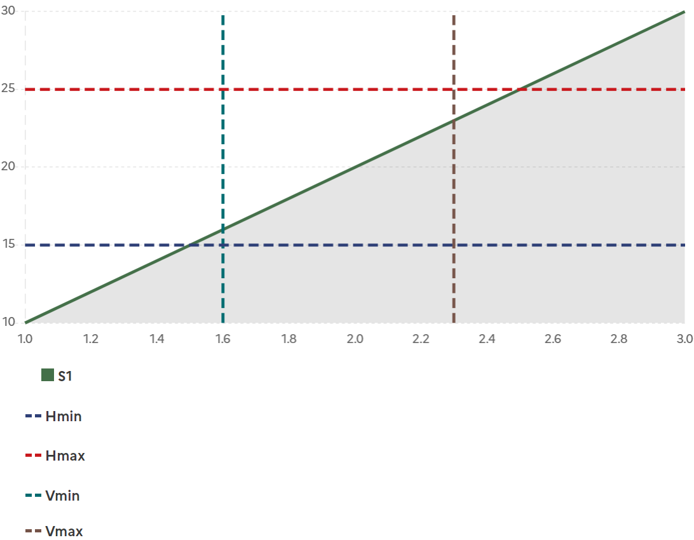

---

# VI. Diagramme circulaire (ou PieChart)

Les diagrammes circulaires (ou PieChart) sont accessibles à travers la balise : `<pie-chart>`.

Les paramètres obligatoires sont :

-   **x** : les noms de chaque groupe sous la forme d’une liste entre crochets

-   **y** : les valeurs de chaque groupe sous la forme d’une liste entre crochets

    **Exemple :**

### 1. Diagramme circulaire plein

L’option **fill = True**, permet de remplir l’intérieur du graphique.

```html
<pie-chart x="[1, 2, 3]" , y="[10, 20, 30]" fill="true"></pie-chart>
```


#### Options PieChart

### 2. Diagramme circulaire creux (donut)

**Exemple** :

```html
<pie-chart x="[1, 2, 3]" , y="[10, 20, 30]"></pie-chart>
```


---

# VII. Diagramme en étoile

Les diagrammes en étoile (ou RadarChart) sont accessibles à travers la balise : `<radar-chart>`.

Les paramètres obligatoires sont :

-   **x** : les noms de chaque groupe sous la forme d’une liste entre crochets

-   **y** : les valeurs de chaque groupe sous la forme d’une liste entre crochets

**Exemple** :

```html
<radar-chart
  x='[["Eating", "Drinking", "Sleeping", "Designing", "Coding", "Cycling", "Running"],
  ["Eating", "Drinking", "Sleeping", "Designing", "Coding", "Cycling", "Running"],
  ["Eating", "Drinking", "Sleeping", "Designing", "Coding", "Cycling", "Running"]]'
  y='[[65, 59, 90, 81, 56, 55, 40],
  [28, 48, 40, 19, 96, 27, 100],
  [12, 12, 20, 23, 13, 14, 15]]'
  </radar-chart>
```

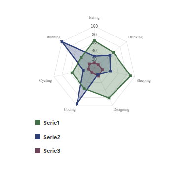

---

# VIII. Jauges (ou GaugeChart)

Ce graphique est généré avec la balise `<gauge-chart> `

Les paramètres obligatoires sont :

· **value** : la valeur actuelle de la jauge sous la forme d’une un nombre

· **init** : la valeur de départ de la jauge

· **target** : la valeur cible de la jauge

**Exemple**:

```html
<gauge-chart value="16" init="10" target="20" color="blue-france"></gauge-chart>
```

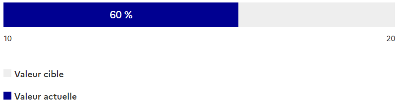

---

# IX. Cartes (ou MapChart)

Les cartes (ou MapChart) sont accessibles à travers la balise : `<map-chart>`.

Les paramètres obligatoires sont :

-   **data :** Un dictionnaire qui pour chaque numéro de département associe la valeur de l’indicateur dans le département
-   **valuenat** : La valeur de l'indicateur à l'échelle natonale. Cette valeur sera affichée dans la sidebar.
-   **name** : Nom de l'indicateur

### Exemples:

```html
<map-chart
    data='{"01": 72, "02": 83, "03": 67, "04": 36, "05": 47, "06": 96, "07": 77, "08": 75, "09": 57, "10": 58, "11": 38,"12": 33, "13": 89, "14": 24, "15": 52, "16": 41, "17": 79, "18": 38, "19": 42, "21": 25, "22": 26,"23": 37, "24": 65, "25": 88, "26": 48, "27": 61, "28": 80, "29": 12, "30": 6, "31": 5, "32": 22, "33": 40,"34": 19, "35": 13, "36": 32, "37": 0, "38": 82, "39": 13, "40": 78, "41": 92, "42": 10, "43": 22, "44": 70,"45": 85, "46": 58, "47": 72, "48": 61, "49": 27, "50": 47, "51": 41, "52": 44, "53": 29, "54": 22, "55": 4,"56": 57, "57": 94, "58": 46, "59": 33, "60": 0, "61": 15, "62": 60, "63": 71, "64": 0, "65": 91, "66": 51,"67": 56, "68": 19, "69": 44, "70": 92, "71": 96, "72": 51, "73": 32, "74": 19, "75": 96, "76": 91, "77": 21,"78": 48, "79": 72, "80": 52, "81": 48, "82": 57, "83": 38, "84": 23, "85": 46, "86": 37, "87": 64, "88": 78,"89": 100, "90": 85, "91": 87, "92": 46, "93": 89, "94": 18, "95": 72, "971": 48, "972": 28, "973": 35,"974": 70, "976": 38, "2A": 63, "2B": "16"}'
    valuenat="10"
    name="Nom de l'indicateur"
></map-chart>
```

#### 1. Découpage par département

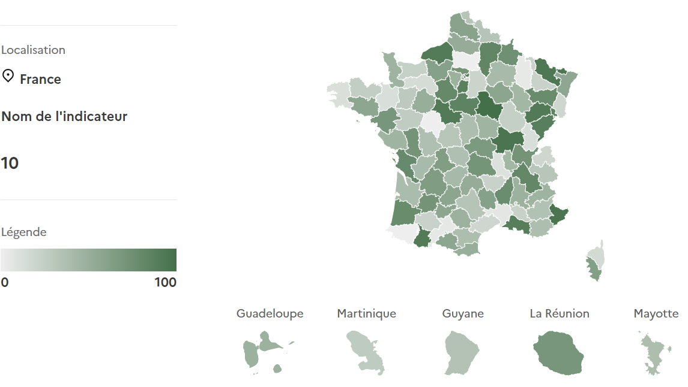

### Options MapChart:

#### 2. Découpage par région

Les paramètres obligatoires sont :

-   **data :** Un dictionnaire qui pour chaque numéro de département associe la valeur de l’indicateur dans le département
-   **valuenat** : La valeur de l'indicateur à l'échelle natonale. Cette valeur sera affichée dans la sidebar.
-   **name** : Nom de l'indicateur
-   **level :** choix du niveau de zoom (départemental, régional etc...)

```html
<map-chart
    data='{"84": 1, "32": 10, "93": 20, "44": 30, "76": 40, "28": 50, "75": 60, "24": 70,"53": 80, "94": 90, "52": 100, "01": 95, "02": 85, "03": 75, "04": 65, "06": "55", "27": 100, "11": 35}'
    valuenat="10"
    name="Nom de l'indicateur"
    level="reg"
>
</map-chart>
```

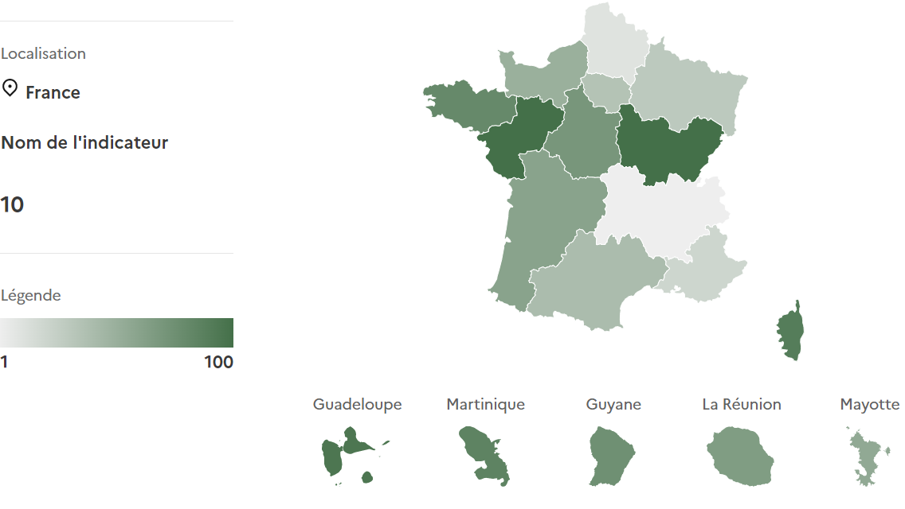

#### 3. Région

Les cartes (ou MapChart) par région sont accessibles à travers la balise : `<map-chart-reg>`.

Les paramètres obligatoires sont :

-   **data :** Un dictionnaire qui pour chaque numéro de département associe la valeur de l’indicateur dans le département
-   **valuereg** : La valeur de l'indicateur à l'échelle regionale. Cette valeur sera affichée dans la sidebar.
-   **name** : Nom de l'indicateur
-   **region :** choix de la région

```html
<map-chart-reg
    data='{"01": 72, "02": 83, "03": 67, "04": 36, "05": 47, "06": 96, "07": 77, "08": 75, "09": 57, "10": 58, "11": 38,"12": 33, "13": 89, "14": 24, "15": 52, "16": 41, "17": 79, "18": 38, "19": 42, "21": 25, "22": 26,"23": 37, "24": 65, "25": 88, "26": 48, "27": 61, "28": 80, "29": 12, "30": 6, "31": 5, "32": 22, "33": 40,"34": 19, "35": 13, "36": 32, "37": 0, "38": 82, "39": 13, "40": 78, "41": 92, "42": 10, "43": 22, "44": 70,"45": 85, "46": 58, "47": 72, "48": 61, "49": 27, "50": 47, "51": 41, "52": 44, "53": 29, "54": 22, "55": 4,"56": 57, "57": 94, "58": 46, "59": 33, "60": 0, "61": 15, "62": 60, "63": 71, "64": 0, "65": 91, "66": 51,"67": 56, "68": 19, "69": 44, "70": 92, "71": 96, "72": 51, "73": 32, "74": 19, "75": 96, "76": 91, "77": 21,"78": 48, "79": 72, "80": 52, "81": 48, "82": 57, "83": 38, "84": 23, "85": 46, "86": 37, "87": 64, "88": 78,"89": 100, "90": 85, "91": 87, "92": 46, "93": 89, "94": 18, "95": 72, "971": 48, "972": 28, "973": 35,"974": 70, "976": 38, "2A": 63, "2B": "16"}'
    valuereg="10"
    name="Nom de l'indicateur"
    region="93"
></map-chart-reg>
```

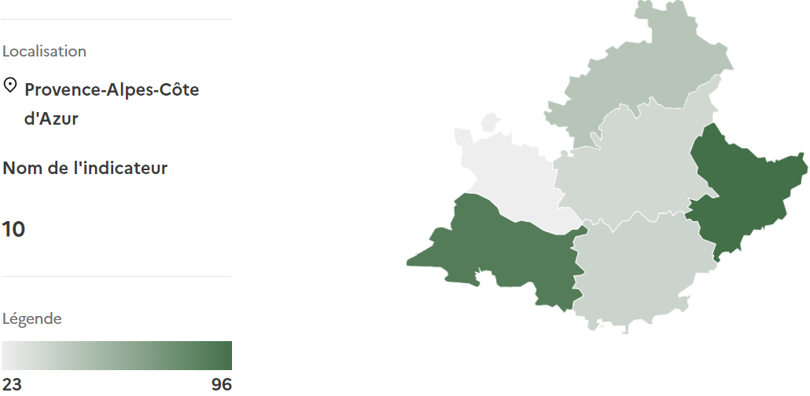

---

# X. Couleurs

Par défaut les noms des indicateurs sont : Série1, Série2, … et les couleurs associés sont #000091, #007c3a, #A558A0. Ils peuvent être modifiés à la convenance de l’utilisateur par les paramètres color et name.

Les couleurs choisis doivent impérativement choisis parmi les [couleurs du dsfr](https://www.systeme-de-design.gouv.fr/elements-d-interface/fondamentaux-identite-de-l-etat/couleurs-palette) de la liste suivante :

Les couleurs apparaîtront dans leur variante **sun** en thème claire et dans leur variante **moon** en thème sombre.


---

### Exemples:

#### 1. Line-Chart avec option color = 'orange-terre-battue'

```html
<line-chart
    x="[1, 2, 3]"
    y="[10, 20, 30]"
    color="orange-terre-battue"
    name="Custom"
></line-chart>
```

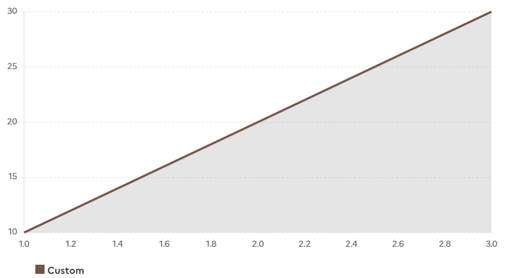

---

#### 2. Multiline-Chart et BarLine-Chart avec option color (plusieurs couleurs)

Pour les graphiques avec plusieurs séries (barchart, piechart, multilinechart, scatterchart), **color** et **name** doivent être fournis sous la forme d'une liste entre crochets et non d'une simple chaîne de caractère

```html
<multiline-chart
    x="[[1, 2, 3], [1, 2, 3]]"
    ,
    y="[[30, 10, 20], [10, 20, 30]]"
    color='["purple-glycine", "green-archipel"]'
    name='["A", "B"]'
></multiline-chart>
```

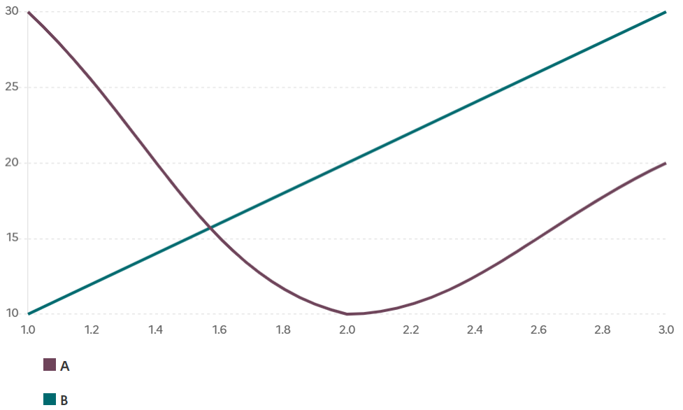

---

Pour le cas du **BarLineChart,** les paramètres **color** et **name** sont associés à la ligne. Pour changer la couleur et le nom des barres, il faut utiliser les paramètre **colorbar** et **namebar**

```html
<bar-line-chart
    x="[1, 2, 3]"
    ,
    y="[30, 10, 20]"
    color="purple-glycine"
    ybar="[20, 15, 12]"
    colorbar="green-archipel"
    namebar="Custom"
></bar-line-chart>
```

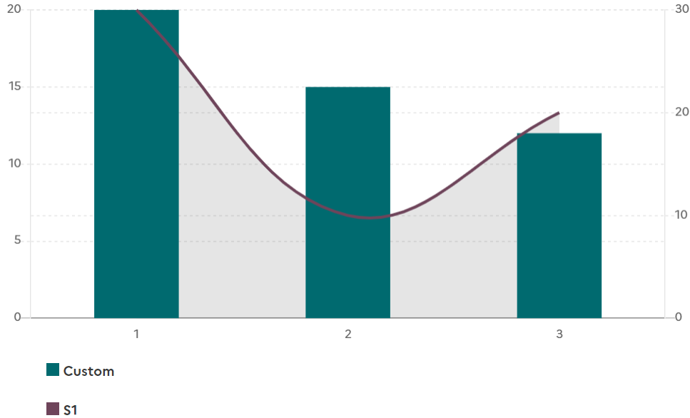

---

Enfin dans le cas de **MapChart**, la modification du nom se fait également par l’intermédiaire de la variable **name**. En revanche pour gérer la couleur de la légende, il faut renseigner le paramètre **color** . Un gradient de couleur sera produit entre deux couleurs : le blanc comme valeur minimale et la couleur choisie comme valeur maximale.

**Exemple :**

```html
<map-chart
    data='{"01": 72, "02": 83, "03": 67, "04": 36, "05": 47, "06": 96, "07": 77, "08": 75, "09": 57, "10": 58, "11": 38,"12": 33, "13": 89, "14": 24, "15": 52, "16": 41, "17": 79, "18": 38, "19": 42, "21": 25, "22": 26,"23": 37, "24": 65, "25": 88, "26": 48, "27": 61, "28": 80, "29": 12, "30": 6, "31": 5, "32": 22, "33": 40,"34": 19, "35": 13, "36": 32, "37": 0, "38": 82, "39": 13, "40": 78, "41": 92, "42": 10, "43": 22, "44": 70,"45": 85, "46": 58, "47": 72, "48": 61, "49": 27, "50": 47, "51": 41, "52": 44, "53": 29, "54": 22, "55": 4,"56": 57, "57": 94, "58": 46, "59": 33, "60": 0, "61": 15, "62": 60, "63": 71, "64": 0, "65": 91, "66": 51,"67": 56, "68": 19, "69": 44, "70": 92, "71": 96, "72": 51, "73": 32, "74": 19, "75": 96, "76": 91, "77": 21,"78": 48, "79": 72, "80": 52, "81": 48, "82": 57, "83": 38, "84": 23, "85": 46, "86": 37, "87": 64, "88": 78,"89": 100, "90": 85, "91": 87, "92": 46, "93": 89, "94": 18, "95": 72, "971": 48, "972": 28, "973": 35,"974": 70, "976": 38, "2A": 63, "2B": "16"}'
    valuenat="10"
    name="Nom de l'indicateur"
    color="blue-ecume"
></map-chart>
```

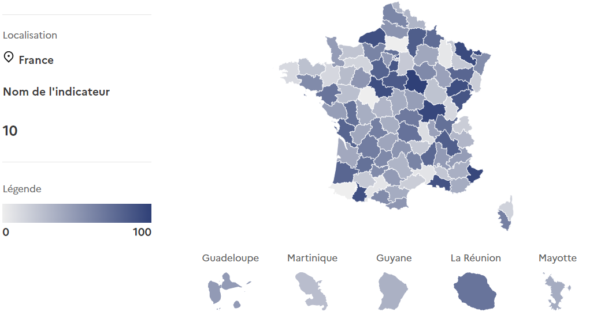

---

# XI. Accessibilité

### Tableaux

Les résultats peuvent également être présenté sous la forme d'un tableau. Ceci permet dans certaines situations d'offrir une alternative à la visualisation des données et ainsi s'adapter au public concerné.

Les paramètres obligatoires sont :

-   **x** : les noms de chaque groupe sous la forme d’une liste entre crochets

-   **y** : les valeurs de chaque groupe sous la forme d’une liste entre crochets

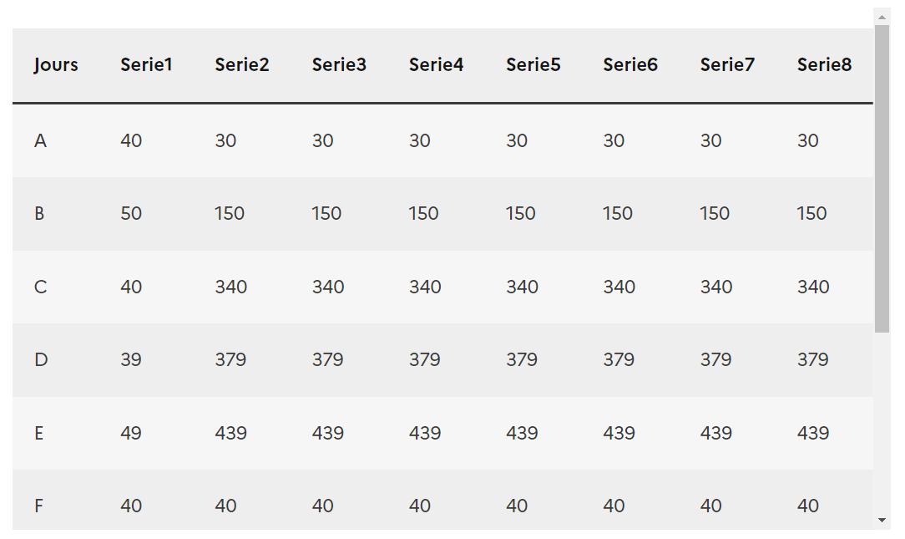

---

# XII. Options

### Barre verticale

Il est possible d’ajouter une ou plusieurs barres verticales par l’intermédiaire du paramètre :

-   **vline** : La ou les valeur(s) sur l’axe des abscisses sous la forme d’une liste entre crochets

Par défaut la couleur de la ligne sera #161616 et son nom V1, V2, … Cela peut être modifié en renseignant les paramètres :

-   **vlinecolor** : La ou les couleur(s) sous forme d’une liste entre crochets

-   **vlinename** : Le ou les nom(s) sous la forme d’une liste entre crochets

**Exemple :**

```html
<line-chart
    x="[1, 2, 3]"
    y="[10, 20, 30]"
    vline="[1.5, 2.5]"
    vlinename='["min", "max"]'
    vlinecolor='["green-archipel", "blue-ecume"]'
></line-chart>
```

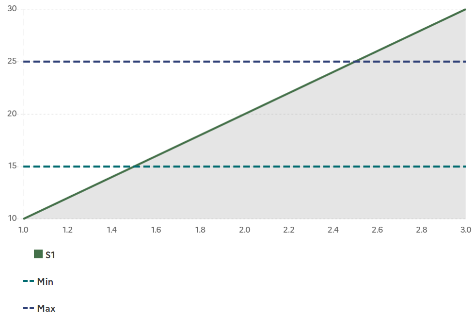

### Barre horizontale

Il est possible d’ajouter une ou plusieurs barre(s) verticale(s) par l’intermédiaire du paramètre :

-   **hline** : La ou les valeur(s) sur l’axe des ordonnées sous la forme d’une liste entre crochets

Par défaut la couleur de la ligne sera #009081 et son nom H1, H2, … Cela peut être modifié en renseignant les paramètres :

-   **hlinecolor** : La ou les couleur(s) sous forme d’une liste entre crochets

-   **hlinename** : Le ou les nom(s) sous la forme d’une liste entre crochets

**Exemple :**

```html
<line-chart
    x="[1, 2, 3]"
    y="[10, 20, 30]"
    hline="[15, 25]"
    hlinename='["min", "max"]'
    hlinecolor='["green-archipel", "blue-ecume"]'
></line-chart>
```

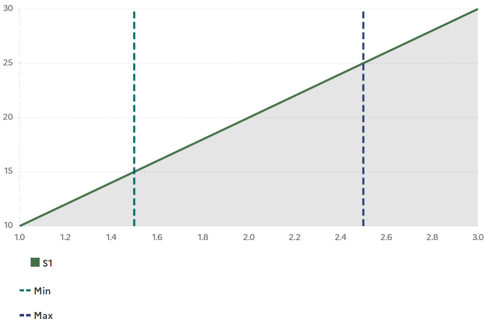

## Contribution

Le processus de contribution est détaillé sur la page [CONTRIBUTING.md](CONTRIBUTING.md).
