# DSFR Chart

DSFR Chart est un module complémentaire au Système de design de l’État (DSFR) pour la visualisation de données. Il s'agit d'une bibliothèque de composant [Vue.js](https://vuejs.org/), sous la forme de web-components, à destination des développeur ayant besoin de graphiques pour représenter des données.


## Installation

L'installation de **DSFR Chart** peut se faire de manières différentes. En téléchargeant l'ensemble des fichiers nécessaires à son utilisation ou en utilisant le gestionnaire de paquets **NPM**.


### Fichiers statiques

Il est possible de télécharger l'ensemble de **DSFR Chart** au format zip ci-dessous. Le zip contient un ensemble de fichiers Javascript et CSS  permettant l'utilisation des différents graphiques.

[Fichiers statiques](https://gouvfr.atlassian.net/wiki/spaces/DB/pages/223019574/D+veloppeurs#Fichiers-statiques)


### NPM

**DSFR Chart** est disponible sur NPM via un ensemble de packages qu'il est possible d'ajouter directement à votre projet. Il est de ce fait nécessaire d'installer [NodeJS](https://nodejs.org), et d'avoir un fichier **package.json** à la racine de votre projet. (Il est possible d'en créer un directement via la commande `npm init`).

Une fois en place, il suffit d'installer le package **dsfr-chart** contenant l’ensemble des composants:

````
npm install dsfr-chart
````

Une fois terminé dsfr-chart sera alors installé dans le dossier `node_modules/dsfr-chart/`


### Structure de DSFR-Chart

La structure mise à disposition, sur le zip ou npm est la suivante :

- **Charts** : contient les fichiers js et css à importer pour utiliser toutes les représentations disponibles.

- **Un dossier par type de représentation** (ex : LineChart) contenant les fichiers js et css à importer pour l'utilisation d'un seul type de graphique.

  

### Configuration de votre projet

#### Prérequis

**DSFR Chart** doit être utilisé dans un projet utilisant le [DSFR](https://www.systeme-de-design.gouv.fr/comment-utiliser-le-dsfr/developpeurs/prise-en-main-du-dsfr/). Le projet doit à minima importer les feuilles css : 

* dsfr.min.css
* icons-system.min.css (dans *utility/icons/icons-system*)


#### Importation des web-components

Pour pouvoir utiliser une représentation graphique dans votre projet, il est nécessaire de charger le fichier javascript correspondant ainsi que sa feuille css associée.

Il existe deux possibilités : 

* Charger tous les composants :

```html
<script src="./Charts/dsfr-chart.umd.js"></script>
<link rel="stylesheet" href="./Charts/dsfr-chart.css">
```

* Charger uniquement un ou plusieurs composants nécessaires (ex : ScatterChart) :

```html
<script src="./ScatterChart/scatter-chart.umd.js"></script>
<link rel="stylesheet" href="./ScatterChart/scatter-chart.css">
```


## Fonctionnement

### Les différentes représentations graphiques

#### LineChart Simple

Ce graphique est généré avec la balise ```<line-chart> ```

Les paramètres obligatoires sont :

·    **x** : les valeurs sur l’axe des abscisses sous la forme d’une liste entre crochets 

·    **y** : les valeurs sur l’axe des ordonnées sous la forme d’une liste entre crochets

**Exemple**:

```html
<line-chart x = '[1, 2, 3]' y = '[10, 20, 30]'></line-chart>
```

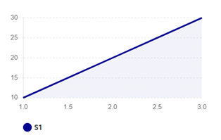

#### LineChart Multiple

Ce graphique est généré avec la balise ```<multi-line-chart>```.

Les paramètres obligatoires sont :

* **x** : les valeurs sur l’axe des abscisses sous forme d’une liste de listes entre crochets 

* **y** : les valeurs sur l’axe des ordonnées sous forme d’une liste de listes entre crochets

**Exemple :** 

```html
<multiline-chart x='[[1, 2, 3], [1, 2, 3]]' y='[[30, 10, 20], [10, 20, 30]]'></multiline-chart>
```

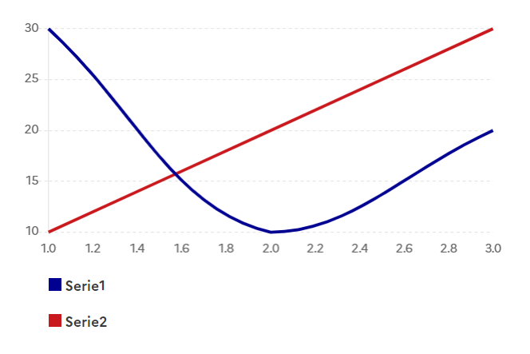


#### ScatterChart

Ce graphique est généré avec la balise ```<scatter-chart>```.

Les paramètres obligatoires sont :

* **x** : les valeurs sur l’axe des abscisses sous forme d’une liste de listes entre crochets 

* **y** : les valeurs sur l’axe des ordonnées sous forme d’une liste de listes entre crochets

**Exemple :** 

```html
<scatter-chart x='[[1, 5, 8], [1, 2, 15]]', y='[[30, 10, 20], [10, 20, 30]]'></scatter-chart>
```

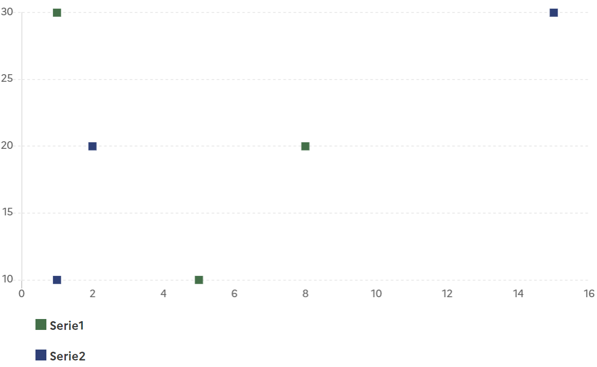


#### BarChart

Ce graphique est généré avec la balise ```<bar-chart>```.

Les paramètres obligatoires sont :

* **x** : les valeurs sur l’axe des abscisses sous forme d’une liste de listes entre crochets 

* **y** : les valeurs sur l’axe des ordonnées sous forme d’une liste de listes entre crochets

**Exemple :** 

```html
<bar-chart x='[["4", "2", "3", "5"], ["4", "2", "3", "5"], ["4", "2", "3", "5"]]' y='[[40, 50, 10, 5], [10, 20, 30, 12], [12, 12, 20, 23]]'></bar-chart>
```

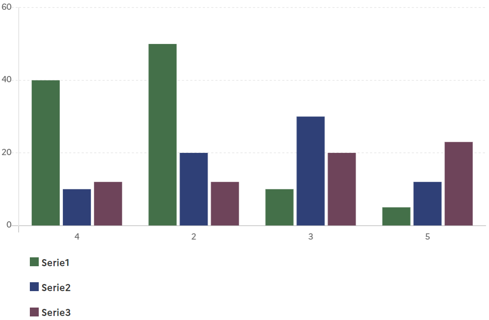


#### BarLineChart

Ce graphique est généré avec la balise ```<bar-line-chart>```.

Les paramètres obligatoires sont :

* **x** : les valeurs sur l’axe des abscisses sous forme d’une liste entre crochets

* **y** : les valeurs sur l’axe des ordonnées de la ligne sous forme d’une liste entre crochets

* **ybar** : les valeurs sur l’axe des ordonnées des barres sous forme d’une liste entre crochets

**Exemple :** 

```html
<bar-line-chart x='[1, 2, 3]' y='[30, 10, 20]' ybar = '[20, 15, 12]'></bar-line-chart>
```

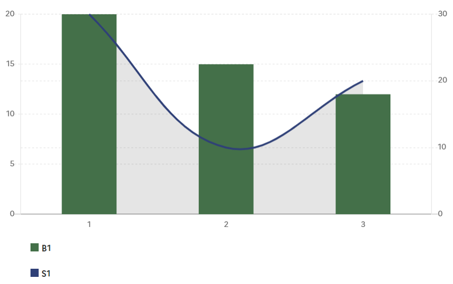


#### PieChart

Ce graphique est généré avec la balise ```<line-chart>```.

Les paramètres obligatoires sont :

* **x** : les noms de chaque groupe sous la forme d’une liste entre crochets

* **y** : les valeurs de chaque groupe sous la forme d’une liste entre crochets

**Exemple :** 

```html
<pie-chart x = '[1, 2, 3]', y = '[10, 20, 30]'></pie-chart>
```

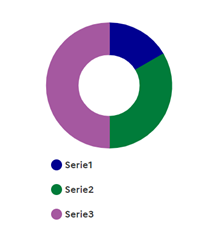


#### MapChart

Ce graphique est généré avec la balise ``<map-chart>``.

Les paramètres obligatoires sont :

* **data :** Un dictionnaire qui pour chaque numéro de département associe la valeur de l’indicateur dans le département
* **valuenat** : La valeur de l'indicateur à l'échelle natonale. Cette valeur sera affichée dans la sidebar.

**Exemple :** 

```html
<map-chart data = '{"01": 72, "02": 83, "03": 67, "04": 36, "05": 47, "06": 96, "07": 77, "08": 75, "09": 57, "10": 58, "11": 38,"12": 33, "13": 89, "14": 24, "15": 52, "16": 41, "17": 79, "18": 38, "19": 42, "21": 25, "22": 26,"23": 37, "24": 65, "25": 88, "26": 48, "27": 61, "28": 80, "29": 12, "30": 6, "31": 5, "32": 22, "33": 40,"34": 19, "35": 13, "36": 32, "37": 0, "38": 82, "39": 13, "40": 78, "41": 92, "42": 10, "43": 22, "44": 70,"45": 85, "46": 58, "47": 72, "48": 61, "49": 27, "50": 47, "51": 41, "52": 44, "53": 29, "54": 22, "55": 4,"56": 57, "57": 94, "58": 46, "59": 33, "60": 0, "61": 15, "62": 60, "63": 71, "64": 0, "65": 91, "66": 51,"67": 56, "68": 19, "69": 44, "70": 92, "71": 96, "72": 51, "73": 32, "74": 19, "75": 96, "76": 91, "77": 21,"78": 48, "79": 72, "80": 52, "81": 48, "82": 57, "83": 38, "84": 23, "85": 46, "86": 37, "87": 64, "88": 78,"89": 100, "90": 85, "91": 87, "92": 46, 93": 89, "94": 18, "95": 72, "971": 48, "972": 28, "973": 35,"974": 70, "976": 38, "2A": 63, "2B": "16"}' valuenat = 3 name = 'Test'></map-chart>
```

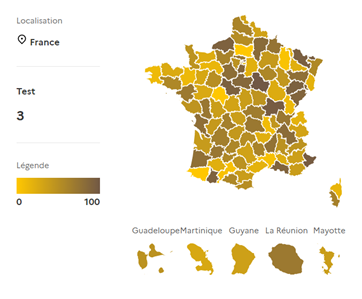


### Les options

#### Noms et couleurs

Par défaut les noms des indicateurs sont : Série1, Série2, … et les couleurs associés sont #000091, #007c3a, #A558A0. Ils peuvent être modifiés à la convenance de l’utilisateur par les paramètres **color** et **name.**

Les couleurs choisis doivent impérativement choisis parmi les [couleurs du dsfr](https://www.systeme-de-design.gouv.fr/elements-d-interface/fondamentaux-identite-de-l-etat/couleurs-palette) de la liste suivante :

* blue-france

* red-marianne

* artwork-major-green-tilleul-verveine

* green-bourgeon

* green-emeraude

* green-menthe

* green-archipel

* blue-ecume

* blue-cumulus

* purple-glycine

* pink-macaron

* pink-tuile

* yellow-tournesol

* yellow-moutarde

* orange-terre-battue

* brown-cafe-creme

* brown-caramel

* brown-opera

* beige-gris-galet

Les couleurs apparaîtront dans leur variante **sun** en thème claire et dans leur variante **moon** en thème sombre.

**Exemple :** 

```html
<line-chart x = '[1, 2, 3]' y = '[10, 20, 30]' color = 'red' name = 'Custom'></line-chart>
```

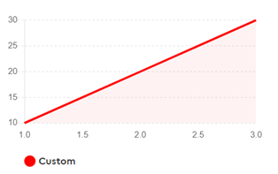


Pour les graphiques avec plusieurs séries (barchart, piechart, multilinechart, scatterchart), **color** et **name** doivent être fournis sous la forme d’une liste entre crochets et non d’une simple chaîne de caractère 

```html
 <multiline-chart x='[[1, 2, 3], [1, 2, 3]]', y='[[30, 10, 20], [10, 20, 30]]' color = '["blue-france", "red-marianne"]' name = '["A", "B"]'></multiline-chart>
```

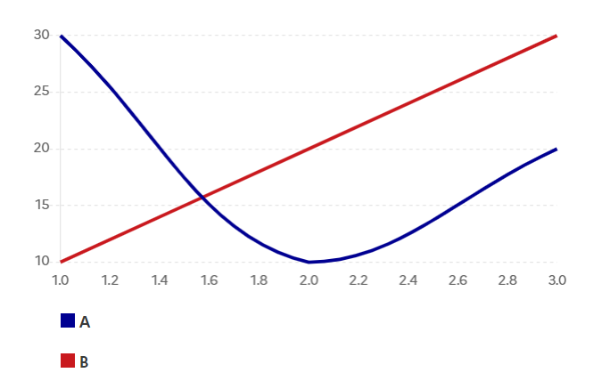


Pour le cas du **BarLineChart,** les paramètres **color** et **name** sont associés à la ligne. Pour changer la couleur et le nom des barres, il faut utiliser les paramètre **colorbar** et **namebar**

**Exemple :**

```html
<bar-line-chart x='[1, 2, 3]', y='[30, 10, 20]' ybar = '[20, 15, 12]' colorbar = 'red-marianne' namebar = 'Custom'></bar-line-chart>
```

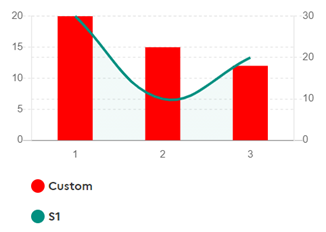


Enfin dans le cas de **MapChart**, la modification du nom se fait également par l’intermédiaire de la variable **name**. En revanche pour gérer la couleur de la légende, il faut renseigner les paramètres **colmin** ('#ffc700' par défaut) et **colmax** ('#ffc700' par défaut)**.** Ils correspondent respectivement à la couleur des valeurs minimale et maximale de la légende. Un gradient de couleur sera fait entre les deux couleurs choisies. 

**Exemple :**

```html
 <map-chart data = '{...}' name = 'Test' colmin = 'yellow', colmax = 'red'></map-chart>
```

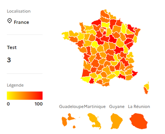


#### Barre verticale

Il est possible d’ajouter une ou plusieurs barres verticales par l’intermédiaire du paramètre :

* **vline** : La ou les valeur(s) sur l’axe des abscisses sous la forme d’une liste entre crochets

Par défaut la couleur de la ligne sera #161616 et son nom V1, V2, … Cela peut être modifié en renseignant les paramètres : 

*  **vlinecolor** : La ou les couleur(s) sous forme d’une liste entre crochets

* **vlinename** : Le ou les nom(s) sous la forme d’une liste entre crochets 

**Exemple :**

```html
<line-chart x = '[1, 2, 3]' y = '[10, 20, 30]' vline = '[1.5, 2.5]' vlinename = '["min", "max"]' vlinecolor = '["green-archipel", "orange-terre-battue"]'></line-chart>
```

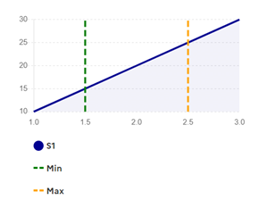


#### Barre horizontale

Il est possible d’ajouter une ou plusieurs barre(s) verticale(s) par l’intermédiaire du paramètre :

* **hline** : La ou les valeur(s) sur l’axe des ordonnées sous la forme d’une liste entre crochets

Par défaut la couleur de la ligne sera #009081 et son nom H1, H2, … Cela peut être modifié en renseignant les paramètres : 

* **hlinecolor** : La ou les couleur(s) sous forme d’une liste entre crochets

* **hlinename** : Le ou les nom(s) sous la forme d’une liste entre crochets 

**Exemple :**

```html
<line-chart x = '[1, 2, 3]' y = '[10, 20, 30]' hline = '[15, 25]' hlinename = '["min", "max"]' hlinecolor = '["green-archipel", "orange-terre-battue"]'></line-chart>
```

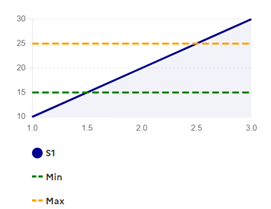


#### Options ScatterChart

On peut choisir de relier les points d’un ScatterChart avec l’option **showline**. On lui affecte la valeur **true** dans le cas ou l’on veut relier les points.

**Exemple** : 

```html
<scatter-chart x='[[1, 5, 8], [1, 2, 15]]', y='[[30, 10, 20], [10, 20, 30]]' showline = true></scatter-chart>
```

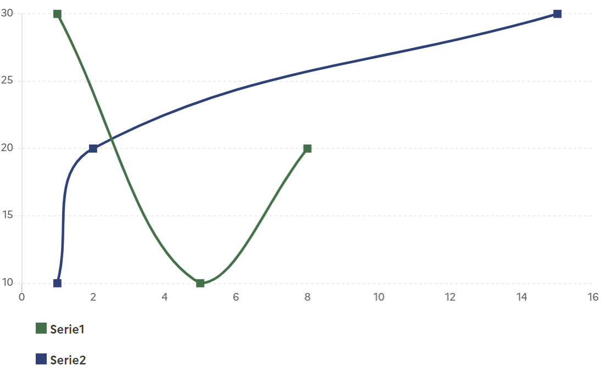


#### Options BarChart

* Pour tracer un **barchart empilé**, il faut renseigner l’option **stacked = true**

**Exemple** :

```html
<bar-chart x='[["4", "2", "3", "5"], ["4", "2", "3", "5"], ["4", "2", "3", "5"]]' y='[[40, 50, 10, 5], [10, 20, 30, 12], [12, 12, 20, 23]]' stacked = true></bar-chart>
```

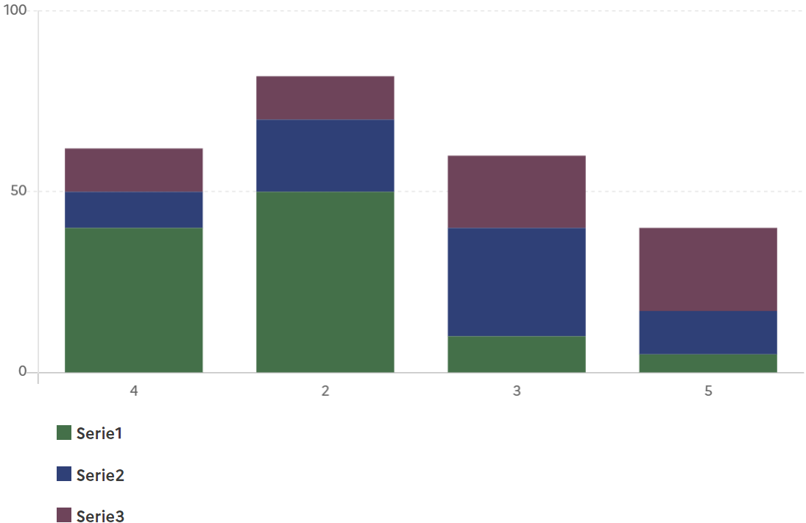


* Pour tracer un **barchart horizontal**, renseigner l’option **horizontal = true**

**Exemple** : 

```html
<bar-chart x='[["4", "2", "3", "5"], ["4", "2", "3", "5"], ["4", "2", "3", "5"]]' y='[[40, 50, 10, 5], [10, 20, 30, 12], [12, 12, 20, 23]]' horizontal = true></bar-chart>
```

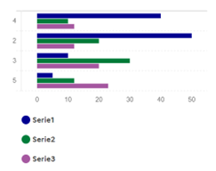


#### Options PieChart

L’option **fill = True**, permet de remplir l’intérieur du graphique.

**Exemple** : 

```html
<pie-chart x = '[1, 2, 3]', y = '[10, 20, 30]' fill = true></pie-chart>
```

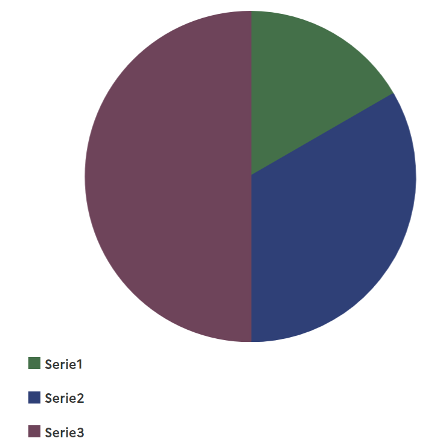

## Contribution

Le processus de contribution est détaillé sur la page [CONTRIBUTING.md](CONTRIBUTING.md).


